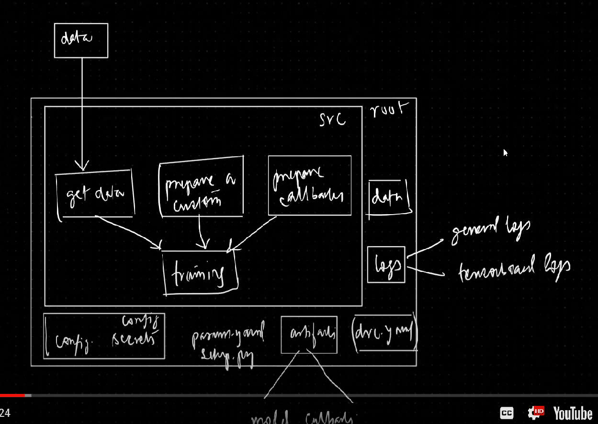

#DVC - DL -TF

## commands - 

### create a new env
```bash
conda create --prefix ./env python=3.7 -y
```
### activate new env
```bash
source activate ./env
```
```bash
touch requirements.txt
```
### Add below packages
```bash
dvc
tensorflow
matplotlib
numpy
pandas
tqdm
PyYAML
boto3
```

```bash
echo "# CNN_DVC" >> README.md
git init
git add README.md
git commit -m "first commit"
git branch -M main
git remote add origin https://github.com/rauthbibek/CNN_DVC.git
dvc init
git push -u origin main
```

